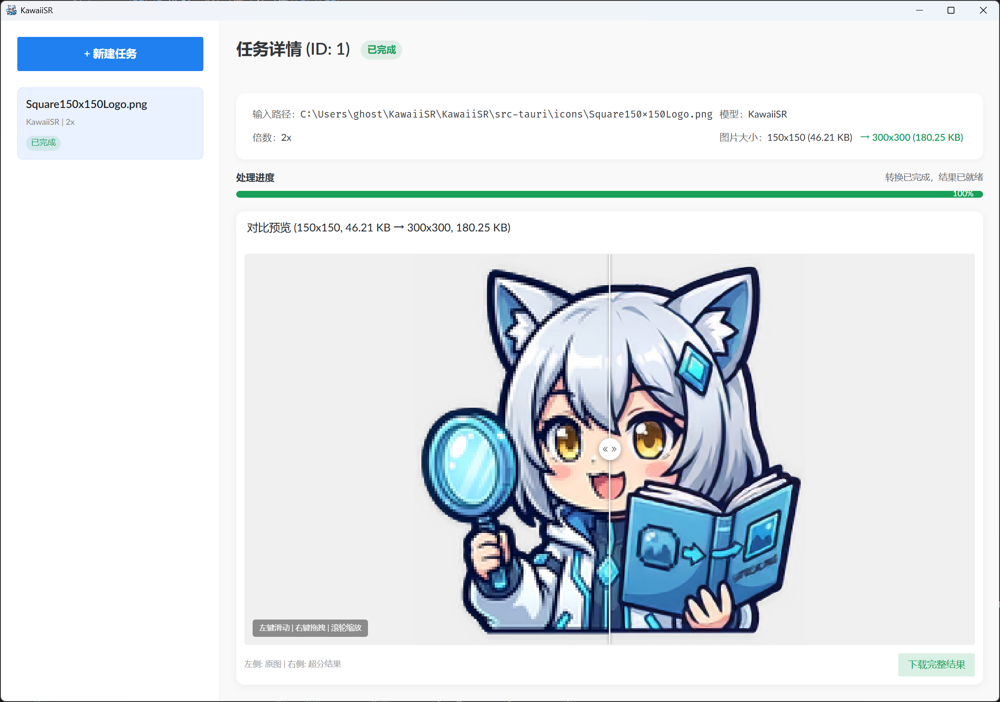

<!-- PROJECT SHIELDS -->
[![Contributors][contributors-shield]][contributors-url]
[![Forks][forks-shield]][forks-url]
[![Stargazers][stars-shield]][stars-url]
[![Issues][issues-shield]][issues-url]
[![Apache License][license-shield]][license-url]

<!-- PROJECT LOGO -->
 

  

  <h3 align="center">KawaiiSR</h3>

  

    一款专注于动漫与实景图像的现代化 AI 超分辨率工具
     
    让画质“超清晰、超可爱”的魔法喵~
     
     
    <a href="https://github.com/ghost-him/KawaiiSR/releases"><strong>📦 下载体验</strong></a>
    &middot;
    <a href="https://github.com/ghost-him/KawaiiSR/issues"><strong>🐛 报告 Bug</strong></a>
    &middot;
    <a href="https://github.com/ghost-him/KawaiiSR/pulls"><strong>✨ 贡献代码</strong></a>
     
     
    
  

<!-- ABOUT THE PROJECT -->
## 📝 项目介绍

  

**KawaiiSR** 是一款融合了高性能推理与现代化 UI 的 AI 超分辨率工具。它不仅仅是一个好看的桌面应用，其背后是由 **数据生成 (Datagen) + 模型训练 (Training) + 极速推理 (Inference)** 构成的完整技术生态。

### 🛠️ 技术栈

![Python][Python] ![Rust][Rust-lang] ![Tauri][Tauri.rs] ![Vue.js][Vue.js] ![PyTorch][PyTorch] ![ONNX Runtime][ONNX-runtime]

### ✨ 核心亮点

*   **全流程代码**：包含从 `sr-datagen` 数据集构建，到 `KawaiiSR-model` 模型训练的完整管线，确保模型针对特定场景的最优表现。
*   **先进的模型架构**：核心算法基于 **CVPR 2023 HAT (Hybrid Attention Transformer)** 改进，针对动漫线条边缘与色彩还原进行了专项优化。
*   **混合损失函数策略**：结合像素损失（Pixel Loss）、伪影抑制（Artifact Loss）和对抗损失（GAN Loss），有效平衡细节恢复与噪点去除。
*   **极致的 Native 性能**：客户端采用 **Rust + Tauri** 构建，结合 **ONNX Runtime** 与 DirectML 硬件加速，实现轻量级与高性能的完美结合。

<!-- ROADMAP -->
## 🗺️ 业务功能与路线图

以下是软件当前支持的业务功能及未来规划，有 Issue 才有动力更新喵✨

### 🖼️ 图像处理核心

| 图标 | 功能                       | 状态     | 说明                               |
| :--- | :------------------------- | :------- | :--------------------------------- |
| 🎭    | **KawaiiSR 模型**          | ✅ 已实装 | 专为二次元图像优化                 |
| 🧩    | **切片拼合 (Tiling) 算法** | ✅ 已实装 | 降低显存占用，支持大图处理         |
| 🎛️    | **高级切块参数配置**       | ✅ 已实装 | 自定义 Overlap 与 Border (Padding) |
| 📽️    | **视频超分辨率**           | 📅 计划中 | 支持 MP4/MKV 等格式                |
| 🎞️    | **GIF 动图支持**           | 📅 计划中 | 动态表情包超分                     |

### ⚙️ 推理后端与优化

| 图标 | 功能                   | 状态     | 说明                      |
| :--- | :--------------------- | :------- | :------------------------ |
| ⚡    | **DirectML 硬件加速**  | ✅ 已实装 | 广泛支持各类 GPU          |
| 📦    | **多模型热加载**       | ✅ 已实装 | 运行时无缝切换模型        |
| 🚀    | **CUDA/TensorRT 适配** | 📅 计划中 | N 卡极致性能优化          |
| 📊    | **质量评测工具**       | 📅 计划中 | 内置 PSNR/SSIM 指标计算   |
| 🌐    | **HTTP 服务端支持**    | 📅 计划中 | 提供基于 HTTP 的 API 服务 |

### 🚀 任务流程与自动化

| 图标 | 功能               | 状态     | 说明                             |
| :--- | :----------------- | :------- | :------------------------------- |
| 📂    | **批量文件夹处理** | ✅ 已实装 | 自动识别并批量导入目录下所有图片 |
| 💾    | **全自动输出保存** | ✅ 已实装 | 任务完成后自动保存至指定目录     |
| 📋    | **多任务并发管理** | ✅ 已实装 | 支持任务实时排队、进度展示与取消 |

### 🎨 界面与交互

| 图标 | 功能                   | 状态     | 说明                           |
| :--- | :--------------------- | :------- | :----------------------------- |
| 🌈    | **现代化 Vue 3 GUI**   | ✅ 已实装 | 流畅的交互体验与 Naive UI 设计 |
| 🔍    | **交互式图像对比**     | ✅ 已实装 | 滑动对比、同步缩放平移预览     |
| 🌐    | **多语言 (i18n) 支持** | 📅 计划中 | 多语言翻译工作                 |
| 🔌    | **滤镜插件系统**       | 📅 计划中 | 支持自定义图像后处理           |

### 🧪 算法研发生态

| 图标 | 功能                | 状态     | 说明                          |
| :--- | :------------------ | :------- | :---------------------------- |
| 🛠️    | **SR-Datagen 工具** | ✅ 已实装 | 工业级数据集生成与退化管道    |
| 🏋️    | **训练框架集成**    | ✅ 已实装 | 基于 HAT 的改进架构与混合损失 |
| 📉    | **ONNX 模型优化**   | ✅ 已实装 | 极简化模型导出与端到端部署    |

<!-- GETTING STARTED -->
## 🚀 开始使用

### 安装

请前往 [Releases](https://github.com/ghost-him/KawaiiSR/releases) 页面下载适合您系统的安装包，安装后即可直接运行。

### 本地开发

如果您希望参与开发或自行编译，请参考我们的贡献指南：
👉 [Contributing Guide](CONTRIBUTING.md)

<!-- FEEDBACK -->
## 🤝 反馈与交流

💡 欲了解完整的功能规划或反馈 Bug，请查看 [Open Issues](https://github.com/ghost-him/KawaiiSR/issues)。

<!-- LICENSE -->
## 📄 许可证

本项目根据 Apache 2.0 许可证分发。有关详细信息，请参阅 [LICENSE.txt](LICENSE.txt)。

<!-- ACKNOWLEDGMENTS -->
## ✨ 特别鸣谢

感谢以下杰出的开源项目与研究工作，为本项目提供了坚实的基础：

*   [CVPR 2023 HAT (Hybrid Attention Transformer)](https://github.com/XPixelGroup/HAT)
*   [CVPR 2024 APISR](https://github.com/Kiteretsu77/APISR)

---

### 💖 支持作者

如果您觉得 KawaiiSR 好用，请考虑支持一下喵：

1.  给项目点一个 **Star** ⭐，这是最大的鼓励！
2.  向身边的朋友安利这款工具 ✨
3.  提交 Issue 或 Pull Request，一起完善这个项目 🥂

**(●'◡'●) 感谢所有关注 KawaiiSR 的开发者与用户！**

> 点个星星谢谢喵！点个星星谢谢喵！点个星星谢谢喵！点个星星谢谢喵！点个星星谢谢喵！点个星星谢谢喵！点个星星谢谢喵！点个星星谢谢喵！

<!-- MARKDOWN LINKS & IMAGES -->
[contributors-shield]: https://img.shields.io/github/contributors/ghost-him/KawaiiSR.svg?style=for-the-badge
[contributors-url]: https://github.com/ghost-him/KawaiiSR/graphs/contributors
[forks-shield]: https://img.shields.io/github/forks/ghost-him/KawaiiSR.svg?style=for-the-badge
[forks-url]: https://github.com/ghost-him/KawaiiSR/network/members
[stars-shield]: https://img.shields.io/github/stars/ghost-him/KawaiiSR.svg?style=for-the-badge
[stars-url]: https://github.com/ghost-him/KawaiiSR/stargazers
[issues-shield]: https://img.shields.io/github/issues/ghost-him/KawaiiSR.svg?style=for-the-badge
[issues-url]: https://github.com/ghost-him/KawaiiSR/issues
[license-shield]: https://img.shields.io/github/license/ghost-him/KawaiiSR.svg?style=for-the-badge
[license-url]: https://github.com/ghost-him/KawaiiSR/blob/master/LICENSE.txt

[Tauri.rs]: https://img.shields.io/badge/Tauri-2496ED?style=for-the-badge&logo=tauri&logoColor=white
[Vue.js]: https://img.shields.io/badge/Vue.js-35495E?style=for-the-badge&logo=vuedotjs&logoColor=4FC08D
[Rust-lang]: https://img.shields.io/badge/Rust-000000?style=for-the-badge&logo=rust&logoColor=white
[PyTorch]: https://img.shields.io/badge/PyTorch-EE4C2C?style=for-the-badge&logo=pytorch&logoColor=white
[Python]: https://img.shields.io/badge/Python-3776AB?style=for-the-badge&logo=python&logoColor=white
[ONNX-runtime]: https://img.shields.io/badge/ONNX_Runtime-00599C?style=for-the-badge&logo=onnx&logoColor=white